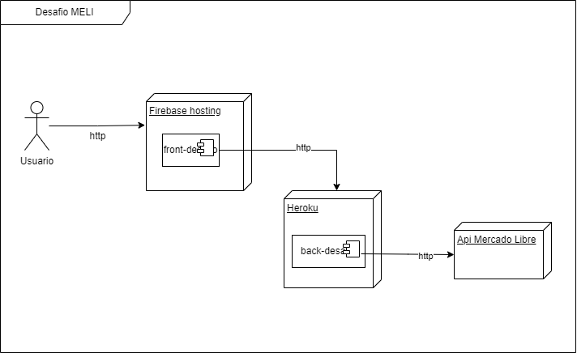
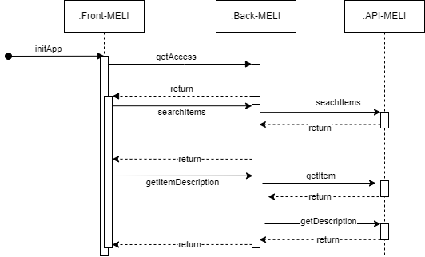

# Front Desafio MELI

Proyecto para la postulación como Desarrollador FullStack para Mercado Libre Chile
 

Este proyecto fue generado en Angular 14

### **Funciones principales**
  1. Barra de búsqueda
  2. Muestra los primeros 4 productos de la búsqueda realizada
  3. Muestra el detalle del producto

---

## Tabla de contenido

>[Descripcion](#descripcion)

>[Stack tecnologico](#stack-tecnologico)

>[Instalacion Local](#instalacion-local)

>[Problemas conocidos](#problemas-conocidos)

>[Contacto](#contacto)

---

## Descripcion

Este proyecto sirve como metodo de medicion de conocimientos para ingresar a como desarrollador FullStack en Mercado Libre Chile. Fue realizado bajo la arquitectura modular del Framework Angular.

### Modelo Alto nivel

### Diagrama de secuencia

---

## Stack tecnologico

_Principales tecnologias usadas en el proyecto_

- **Node** version 
- **npm** version
- **Angular** version
- **Jest** version

### Dependencias

- **Firebase** version

---

## Instalacion Local

Run `ng serve` for a dev server. Navigate to `http://localhost:4200/`. The app will automatically reload if you change any of the source files.

### Code scaffolding

Run `ng generate component component-name` to generate a new component. You can also use `ng generate directive|pipe|service|class|guard|interface|enum|module`.

### Build

Run `ng build` to build the project. The build artifacts will be stored in the `dist/` directory. Use the `--prod` flag for a production build.

### Running unit tests

Run `ng test` to execute the unit tests via [Karma](https://karma-runner.github.io).

### Running end-to-end tests

Run `ng e2e` to execute the end-to-end tests via [Protractor](http://www.protractortest.org/).

---

## Problemas conocidos

Para ver la siguiente informacion ingresar [aqui](./docs/TROUBLESHOOTING.md)
